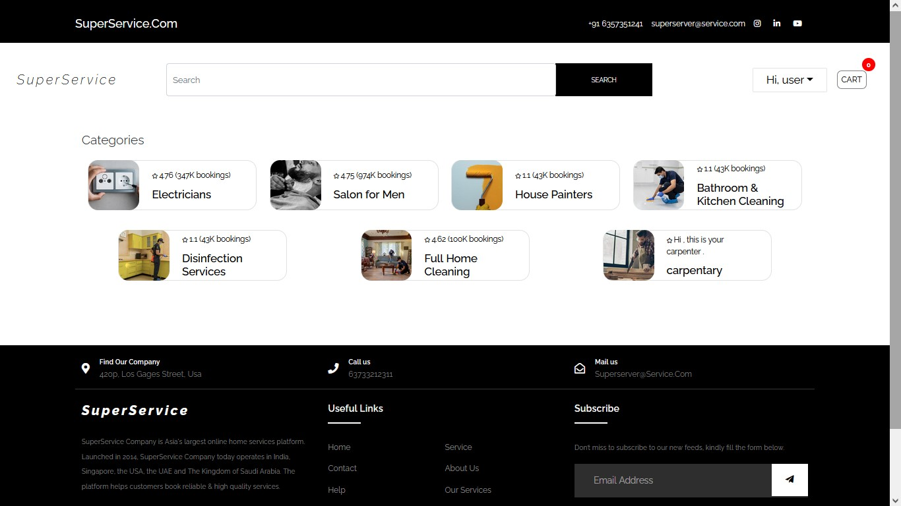

# SuperService

Super Service is a cutting-edge web application designed to provide a wide range of convenient services to urban dwellers. Built on the MERN stack (MongoDB, Express.js, React.js, Node.js), Super Service harnesses the power of modern web technologies to deliver a seamless and user-friendly experience.

With the rapid growth of urbanization, Super Service aims to address the diverse needs of individuals residing in bustling cities. Whether it's transportation, food delivery, home services, or more, Super Service brings together an array of services under one platform, streamlining the urban lifestyle.

# use this credentials for demo:
    - email: user@g.com
    - password: 12121212
For Full Experiance {DEMO}
# Development Details



# Work Proof

More detailed information about the application extensive [Features](./userguide.md#features), and intutive usage can be found in the [User Guide](./userguide.md) and [Screenshots](./screenshots.md) file.

## Architecure and Technical Details

The project is developed using the following MERN technologies and frameworks:

- Frontend: ReactJs, Redux, JavaScript, HTML, CSS
- Backend: Node.js with Express, JWT
- Database: mongoDB

## Team
The project is developed from scratch by the team members and no code was copied from any other source. 

| Name | Github Handle | Image |
| --- | --- | --- |
| Lokesh Kumar M | @LokeshKumar-Dev  |  |

## Mongo Database Models

The application consists of the following entities:

1. User:
    - First Name: String
    - Last Name: String
    - Date of Birth: Date
    - Salary: Number
    - Email: String (required, unique)
    - Image: String
    - Password: String (required)
    - Currency: String (default: "INR")
    - Expense: Number (default: 0)
    - Expense List: Array (default: [0, 0, 0, 0, 0, 0, 0, 0, 0, 0, 0, 0])
    - Income: Number (default: 0)
    - Income List: Array (default: [0, 0, 0, 0, 0, 0, 0, 0, 0, 0, 0, 0])
    - OTP: String (default: "")
    - Is Verified: Boolean (default: false)
    
2. Product:
    - name: String (required)
    - by: String (required)
    - image: String
    - description: String (required)
    - reviews: [reviewSchema]
    - rating: Number (required, default: 0)
    - numReviews: Number (required, default: 0)
    - price: Number (required, default: 0)
    - time: String (required, default: "10 mins")
    - cId: Number (required, default: 0)
    - category: 
        - id: Number (required)
        - name: String (required)
        - image: String (required)
        - description: String (required)
        - category: 
          - type: mongoose.Schema.Types.ObjectId,
          - required: true,
          - ref: "Category",
  
3. order:
    - user: {
        type: mongoose.Schema.Types.ObjectId,
        required: true,
        ref: "User",
      }
    - orderItems: [{
          name: { type: String, required: true },
          qty: { type: Number, required: true },
          image: { type: String, required: true },
          price: { type: Number, required: true },
          by: { type: String, required: true },
          product: {
            type: mongoose.Schema.Types.ObjectId,
            required: true,
            ref: "Product",
          }
        }
      ]
    - vendors: Array
    - shippingAddress: {
        houseNumber: String,
        address: { type: String, required: true },
        city: { type: String, required: true },
        postalCode: { type: String, required: true },
        country: { type: String, required: true },
      }
    - paymentMethod: {
        type: String,
        required: true,
        default: "PayPal",
      }
    - paymentResult: {
        id: String,
        status: String,
        update_time: String,
        email_address: String,
      }
    - taxPrice: {
        type: Number,
        required: true,
        default: 0.0,
      }
    - status: {
        type: Number,
        required: true,
        default: -1,
        validate: function () {
          return (this.status >= -1 && this.status < 5);
        }
      }
    - shippingPrice: {
        type: Number,
        required: true,
        default: 0.0,
      }
    - totalPrice: {
        type: Number,
        required: true,
        default: 0.0,
      }
    - isPaid: {
        type: Boolean,
        required: true,
        default: false,
      }
    - paidAt: Date
    - isDelivered: {
        type: Boolean,
        required: true,
        default: false,
      }
    - deliveredAt: Date
    - scheduledDate: {
        type: Date,
        required: true,
      }
    - scheduledTime: {
        type: Date,
        required: true,
      }
    
##  Installation and Usage

### 1. Clone the repository:
   - Open your command-line interface (CLI) or terminal.
   - Navigate to the directory where you want to clone the repository using the cd command.
   - Once you are in the desired directory, use the git clone command followed by the repository URL.
   - Wait for the cloning process to complete.
   - You have successfully cloned the directory!

### 2. Install dependencies:

#### Prerequisites
Make sure you have [Node.js](https://nodejs.org) and [npm](https://www.npmjs.com) (Node Package Manager) installed on your machine.

#### Steps

1. Ensure cloning process above is completed without any error. .

2. Navigate to the project's root directory in your command-line interface (CLI) or terminal.

4. Switch to folder `superservice` and run the following command to install the project dependencies:
   ```shell
   npm install
   npm start
   ```

### 3. Start the API server:
- create a .env file in root of `superserver` folder with following entries
```shell
#Mongo Auth value
db_USERNAME = ""
db_PASSWORD = ""

JWT_SECRET = ""
EMAIL = ""
PASSWORD = ""

PORT = 5000
```
- Switch to folder `superserver` and run the following command to run API server
```shell
npm start
```

### 4. Start the UI server:
- Switch to folder `superservervice` and run the following command to run the UI server
```shell
npm start
```
